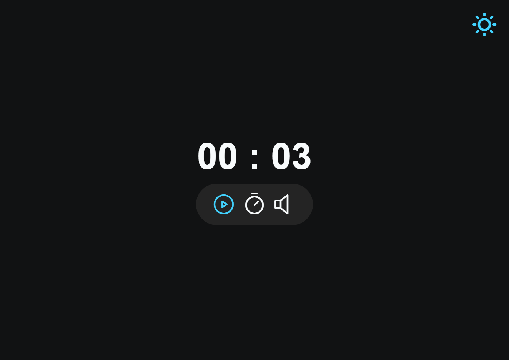

# Explorer Turma 6

> Projeto 08 criado no programa Explorer da RocketSeat

Nesse projeto passamos a utilizar o JavaScript na prática em um site estilizado, aprendemos a modularizar a aplicação dividindo cada área da aplicação em arquivos diferentes, fazer a mudança entre light/dark mode, recurso de acessibilidade para deficientes visuais, dataset, edição de conteúdo na tela com 'focus', utilizar '/\d/' para aceitar apenas números e como adicionar sons na aplicação

>Desktop

## Tecnologias
HTML
CSS
JavaScript

## Contato
daniel.aretakis@hotmail.com